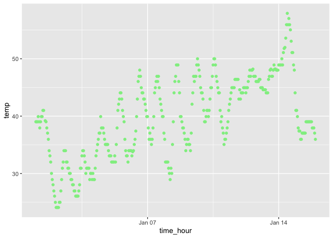

p8105_hw1_bac2214
================
Brianna Carnagie
2023-09-15

``` r
library(moderndive)
```

# Problem 1

This **code chunk** loads the data set:

``` r
data("early_january_weather")
```

This code chunk creates values for the questions asked in problem 1:

``` r
num_rows = nrow(early_january_weather)
num_col = ncol(early_january_weather)

variable_contents = ls(early_january_weather)

print(variable_contents)
```

    ##  [1] "day"        "dewp"       "hour"       "humid"      "month"     
    ##  [6] "origin"     "precip"     "pressure"   "temp"       "time_hour" 
    ## [11] "visib"      "wind_dir"   "wind_gust"  "wind_speed" "year"

``` r
mean_temperature = mean(early_january_weather$temp)
mean_temperature_rounded = round(mean_temperature, digits = 2)
```

After running this code chunk, I see that the dataset contains **15**
columns and **358** rows. The dataset contains basic information in
regards to weather for the first 15 days in January including but not
limited to the humidity, temperature, and wind speed every hour.
According to this dataset, the first 15 days in January had an average
temperature of 39.58 degrees Fahrenheit.

Make a scatterplot of temp (y) vs time_hour (x); color points using the
humid variable (adding color = … inside of aes in your ggplot code
should help). Describe patterns that are apparent in this plot.

This code chunk will create the scatterplot.

``` r
library(ggplot2)
question1_plot = ggplot(early_january_weather, aes(x = time_hour, y = temp)) + geom_point(color = 25)
print(question1_plot)
```

<!-- -->
